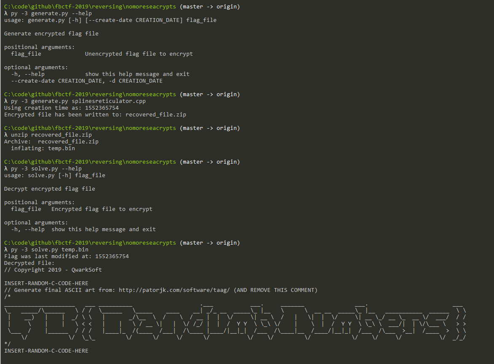

# NoMoreSeaCrypts

## Instructions to Build Challenge
**DO NOT MODIFY** THE C code in `src/` without changing the `generate.py` and `solve.py` Python files.

### Build Challenge Binary
Prior to building the binary, please ensure that:
* CTR-mode prefix buffers match up w/ Python scripts
* Other constants are okay for release (filenames, time to sleep, first line of flag file)
* Ensure the macro defining `DEBUG_MODE` is commented out
* Ensure `TARGET_FIRST_LINE` matches with the first line of the [flag file](splinesreticulator.cpp).

#### Building for Release and Testing
To create a release binary:
* Ensure that the `DEBUG_MODE` macro in [main.cpp](src/main.cpp) is commented out.
* Run `make` in the `src/` directory.
* Add the encrypted flag file (`temp.bin`) from the `dist` directory and the challenge binary into a ZIP archive (`recovered_files.zip`)
* Send `recovered_files.zip` to the CTF challengers.

To create a binary for testing:
* Uncomment the `DEBUG_MODE` macro in main.cpp
* Run `make` in the `src/` directory.
  * By default, symbols are stripped and the sample is statically linked.
  * If you don't want static linking, remove `-static` from `LDFLAGS` in [Makefile](src/Makefile).
  * If you want symbols for debugging, comment out the `strip -s main` line in [Makefile](src/Makefile).
* Run [pre_testrun.sh](pre_testrun.sh) to create the directory structure (and flag file) needed for the sample to work.
* Run the sample: `./main`
* Run [post_testrun.sh](post_testrun.sh) to remove the directory structure once testing is complete.
  * `src` directory is not deleted.

### Generating and Solving the Challenge
The flag is stored as ASCII art within a bytearray in [splinesreticulator.cpp](splinesreticulator.cpp).

Use [generate.py](generate.py) to encrypt the challenge file using either the current time or a unix timestamp provided as an argument to the script.

As file modification timestamps are important to this challenge, the encrypted file is ZIP'd to prevent accidental modifications.

To solve the challenge, unzip the generated ZIP archive to yield `temp.bin`. Use [solve.py](solve.py) to solve the challenge file and display the decrypted output on the console.

